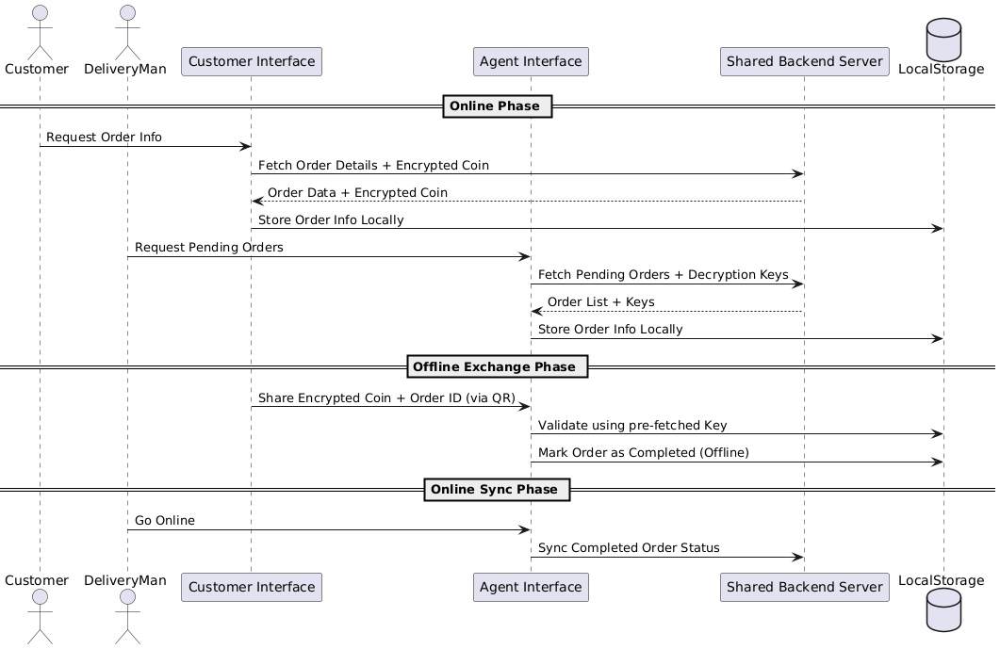

# Hackon Amazon Season 5

> A transaction system designed to enable payments in remote areas where digital payment methods are not feasible and cash is not a convenient option. This is achieved through the use of encrypted digital coins that can be securely redeemed upon product delivery.

## UML Interaction Diagram



## Project Structure

```bash
├── backend
│   ├── express           # Node.js backend (Express + Prisma)
│   └── flask             # Python backend (Flask)
├── frontend
│   ├── agentInterface    # Frontend for agents
│   └── customerInterface # Frontend for customers
```

## Setup Instructions

### 1. Clone the Repository

```bash
git clone https://github.com/mohitJoshi0527/Hackon_amazon
cd Hackon_amazon
```

### 2. Set Up the Express Backend

```bash
cd backend/express
npm install
```

### 3. Set Up the Flask Backend

```bash
cd ../flask
pip install -r requirements.txt
```

### 4. Set Up the Agent Interfaces

```bash
cd frontend/agentInterface
npm install
```

### 5. Set Up the Agent Interfaces

```bash
cd frontend/customerInterface
npm install
```

> **Note:** Ensure you create a `.env` file in each service directory using the `.env.example` file as a template.

## Running the Application

| Service            | Location                     | Command     | PORT |
| ------------------ | ---------------------------- | ----------- | ---- |
| Express Backend    | `backend/express`            | `npm start` | 8000 |
| Flask Backend      | `backend/flask`              | `flask run` | 5000 |
| Agent Interface    | `frontend/agentInterface`    | `npm start` | 8081 |
| Customer Interface | `frontend/customerInterface` | `npm start` | 8082 |

## Notes

- Ensure all services have their environment variables configured properly before running.
- Frontends may use React Native or Web platforms, so tools like **Expo CLI** or **Webpack** might be needed.
- Make sure ports used by services do not conflict.
